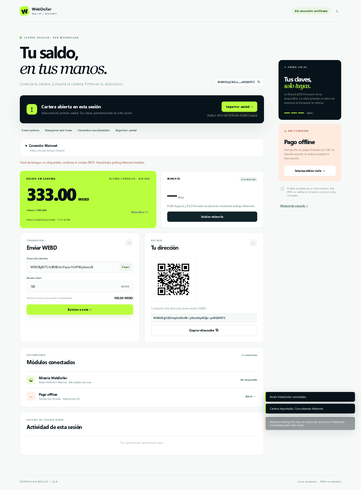
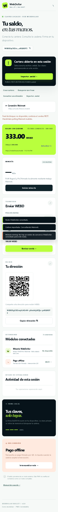

# Manual de usuario · WebDollar Wallet

## Abrir e instalar

1. Abre la carpeta en VS Code y sirve index.html con Live Server. También puedes ejecutar npm start y abrir http://127.0.0.1:4173.
2. En Android, abre la dirección HTTPS de tu despliegue en Chrome y selecciona Instalar aplicación o Agregar a pantalla de inicio. El botón Instalar app aparece cuando Chrome permite solicitar la instalación.
3. En iPhone utiliza Safari, Compartir y Añadir a pantalla de inicio.
4. La versión instalada utiliza display: standalone. La primera apertura requiere conexión para guardar los recursos estáticos.
5. No abras mediante file://: los módulos y el Service Worker requieren HTTP local o HTTPS.

## Importar el archivo del usuario

1. Pulsa **Importar .webd**.
2. En el selector del sistema busca el archivo:
   C:\Users\ID140\Downloads\WEBD$22aea7b17caa785799c555bb56deb87070844881.webd
3. La PWA valida claves, dirección y checksum. No carga el archivo a ningún servidor.
4. Si la importación es válida, muestra la dirección y su QR. El saldo permanece en — hasta recibir una respuesta válida de un nodo.
5. Despliega **Conexión Mainnet**. La aplicación prueba primero `https://pool.timi.ro`; si deseas usar otro nodo, escribe su URL REST y pulsa **Conectar y consultar**. Para transmitir, el adaptador usa el transporte nativo del nodo WebDollar después de tu confirmación; si el operador dispone de un JSON-RPC explícito también puede configurarse esa ruta.
6. Introduce cualquier credencial RPC solamente en el apartado de autenticación de la aplicación. La contraseña se retira del campo después de configurarla.

Durante la sesión Mainnet auditada, el nodo devolvió `333.000 WEBD` antes del envío real y `267.314 WEBD` después de su confirmación. Si un nodo falla, la interfaz mantiene la última consulta identificada, sin sustituirla por un saldo inventado.

## Crear y recuperar una cartera

Crear cartera genera 24 palabras BIP39 con aleatoriedad local. Guarda las palabras y exporta también el .webd. Recuperar con frase utiliza la derivación de esta PWA; no presupone que una frase de otro cliente WebDollar siga el mismo método. Exportar .webd permite utilizar las claves en el cliente oficial.

La frase desaparece al cerrar el diálogo y no se almacena. La descarga .webd está sin cifrar: conserva esa copia de forma privada. No hay recuperación posible si se pierden tanto las palabras como el archivo.

## Recibir

Comparte la dirección completa o el QR de **Tu dirección**. Los QR se generan en el dispositivo y pueden mostrarse sin internet. La dirección de consulta solo lectura también puede utilizarse para verificar la recepción sin abrir una clave privada.

## Revisar un envío

1. Introduce la dirección destino y el monto total en WEBD.
2. Pulsa **Revisar envío**.
3. Comprueba la dirección completa, el débito y el importe recibido.
4. Cuando la operación es compatible, **Confirmar Envío** es el paso que solicita la firma/transmisión. La aplicación valida previamente la comisión fija, los mínimos y la tarifa del minero; si algo no cumple, el motivo aparece en el diálogo.
5. Un hash por sí solo no demuestra confirmación. La actividad diferencia firmado, enviado al RPC, mempool y confirmado en bloque. Usa Verificar en nodo y abre el explorador oficial; copia allí el hash para verificarlo.

La aplicación aplica una comisión fija de 10 WEBD a tesorería por cada transferencia. Por ejemplo, si envías 100 WEBD, el destinatario recibe 90 WEBD y 10 WEBD van a la dirección fija documentada en README. Esta comisión no sustituye la tarifa del minero, que se añade al débito del remitente.

La política del cliente oficial exige 10 WEBD por cada salida. Con la comisión fija de 10 WEBD, el destinatario también debe recibir al menos 10 WEBD, así que el monto total mínimo compatible es 20 WEBD; además la PWA suma aproximadamente 9.686 WEBD de diferencia para el minero al débito. Por eso la prueba de 0.01 WEBD y el saldo declarado de 333 WEBD no permiten verificar un envío aceptado bajo esa política; una cuenta con saldo suficiente puede continuar después de la revisión humana.

## Pago offline y Simular NFC

1. Antes de desconectarte, importa la cartera y obtén una consulta válida de saldo y nonce.
2. Abre **Intercambiar vale**.
3. Escribe la dirección de quien recibirá y el monto.
4. Pulsa **Generar y firmar vale**. Esta acción crea una transacción firmada en memoria y su QR; no la transmite.
5. Copia el vale o guarda/transfiere la imagen QR a la otra instancia.
6. En la instancia receptora, carga su cartera o consulta su dirección. Abre el módulo y pega el vale, o utiliza **Simular NFC · Leer imagen QR**.
7. Pulsa **Validar recepción**. La app verifica la firma, el reparto y el destinatario, y rechaza el mismo vale si ya está registrado en esa sesión.
8. Al reconectar utiliza **Revisar reclamo Mainnet**. El reclamo requiere confirmación y queda sujeto a la misma política de red.

El saldo confirmado no cambia al intercambiar un vale. Los fondos no están bloqueados en cadena: el emisor podría gastar desde otro cliente y el vale puede quedar obsoleto por nonce o timelock. Esta versión no garantiza dinero Ecash anónimo ni evita el doble gasto antes de la liquidación. Copia los vales antes de cerrar la sesión.

## Minería y fallos de módulos

El botón de minería inicia el módulo aislado de trabajo PoW/PoS Mainnet. El PoW usa Argon2 en un Worker y el PoS calcula la prueba con el saldo comunicado por el pool; la cabecera se firma localmente sin entregar la clave privada al Worker. Si el pool no acepta la conexión, verás **No disponible** y la cartera seguirá mostrando el saldo.

Si el módulo falla, la cartera conserva la dirección y el saldo consultado. El fallo aparece como No disponible; el resto de la interfaz permanece operativo.

## Bloquear

Pulsa el icono de bloqueo. Se detiene la consulta periódica y se sobrescribe el array de clave privada de la sesión. La dirección y la última consulta siguen visibles. Importa de nuevo para firmar. Cerrar o recargar también elimina la sesión; esta versión no persiste vales ni historial.

## Capturas de interfaz

## Instalar el APK local de desarrollo

Desde la carpeta del proyecto ejecuta `npm run build:apk:local`. El resultado es `WebDollar-wallet-debug.apk`, firmado con la clave de depuración para pruebas. Puedes abrirlo en un emulador o instalarlo con `adb install -r WebDollar-wallet-debug.apk` si Android Platform Tools está disponible. Esta variante contiene los archivos de la PWA dentro de un WebView; no contiene la cartera física ni una semilla inicial.

**Las siguientes son capturas reales de pruebas locales con un nodo de contrato controlado. El saldo 333 mostrado no es evidencia Mainnet ni corresponde a la cartera privada del usuario.**

Escritorio, 1440 px:

Móvil, viewport 375 × 812 con captura de página completa:

Se verificó además ausencia de desplazamiento horizontal a 320 px. No se probó un dispositivo Android físico ni Safari/iOS.
